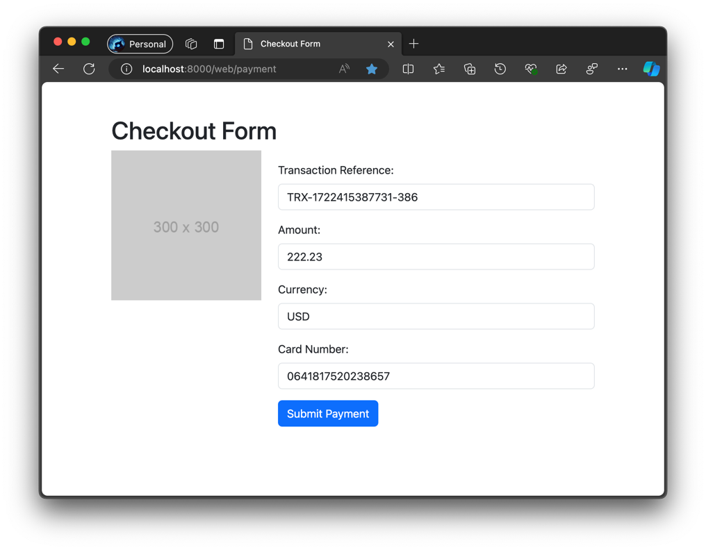
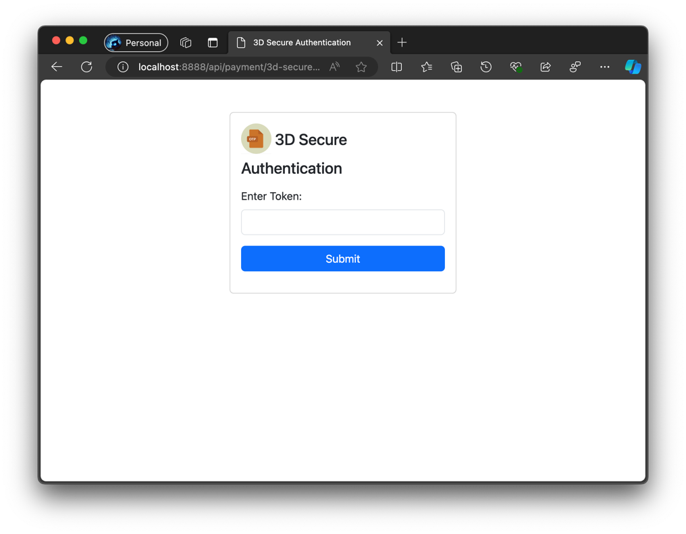

# Payment Gateway Application

## Getting Started

### Prerequisites

- Java 21
- Gradle

### Running the Application

1. Clone the repository.
2. Navigate to the project directory.
3. Run `./gradlew bootRun` to start the application.

### Testing

- Run `./gradlew test` to execute tests.

### Endpoints

- `POST /api/payments/process` - Process a payment.
- `GET /api/payments/history` - Retrieve transaction history.

### Mock Bank API

- Use [mock-bank-api](https://github.com/yelrivadk/mock-bank-api) to simulate
  the mock bank API.

### Demo

- http://localhost:8000/web/payment-result
  
- 3dsecure
  
- 